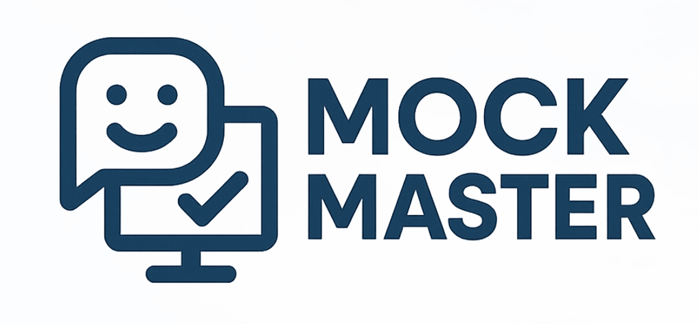

# MockMaster - AI 模拟面试系统


## 📌 项目简介
MockMaster 是一款基于 AI 技术的模拟面试系统，通过计算机视觉和自然语言处理技术，为用户提供沉浸式的面试体验和专业的反馈建议。系统主要功能包括：

- **个人面试模拟**：1v1 AI 面试官对话
- **群体面试模拟**：多人协作面试场景
- **实时分析反馈**：面部表情、手势识别分析
- **简历优化**：智能简历评分与建议
- **面试题库**：海量行业面试问题

## ✨ 核心功能

### 1. 面部表情实时分析


系统使用 MediaPipe Face Landmarker 模型实时检测：
- 眼神交流频率
- 微笑自然度
- 专注程度
- 情绪状态（积极/消极）
- 微表情变化

### 2. 手势识别分析


通过手势识别模型检测：
- 常用手势（OK、点赞、指向等）
- 手势自然度
- 手势与表达的协调性
- 避免负面手势（如摸脸、抱臂等）

### 3. AI 面试反馈
- 语言流利度评分
- 表达逻辑性分析
- 专业术语使用建议
- 回答结构优化

## 🛠️ 技术栈

### 前端
- Vue 3 + Vite
- MediaPipe Tasks Vision
- Chart.js
- Tailwind CSS

### 后端
- Node.js + Express
- DeepSeek API
- WebSocket 实时通信

## 🚀 快速开始

### 环境准备
确保已安装：
- Node.js (v16+)
- npm (v8+)
- Git

### 安装与运行
```bash
# 克隆仓库
git clone https://github.com/CFinTech/MockMaster.git

# 进入项目目录
cd mockmaster

# 安装依赖
npm install

# 启动开发服务器
npm run dev
```

### 生产构建
```bash
npm run build
```

## 📂 项目结构
```
mockmaster/
├── .vscode/                      # VSCode 配置文件夹
├── [TODO]_previous/              # 之前旧版本的代码
├── AI_analyse/                   # AI分析相关的代码
├── figures/                      # 存放README相关的图片资源
├── node_modules/                 # Node.js 项目依赖库
├── public/                       # 静态资源文件夹
├── src/                          # 源代码文件夹
│   ├── assets/                   # 存放静态资源，如图片、样式等
│   ├── components/               # 存放Vue组件
│   ├── router/                   # Vue路由配置
│   ├── views/                    # 页面视图组件
│   │   ├── Calendar.vue          # 我的日历页面
│   │   ├── Evaluation.vue        # 面试评价页面
│   │   ├── Interview.vue         # 模拟面试页面
│   │   ├── MainPage.vue          # 主页面
│   │   ├── MultiInterview.vue    # 多人群面页面
│   │   ├── Resume.vue            # 个人简历页面
│   │   ├── Simulate.vue          # 模拟面试入口页面
│   │   └── SingleResume.vue      # 简历编辑页面
│   ├── App.vue                   # Vue应用根组件
│   ├── main.js                   # 应用入口文件
│   └── style.css                 # 全局样式文件
├── .gitignore                    # Git忽略文件配置
├── index.html                    # 应用入口HTML文件
├── package-lock.json             # 项目依赖锁定文件
├── package.json                  # 项目配置文件
└── vite.config.js                # Vite配置文件
```

## 🤝 贡献指南
欢迎提交 Pull Request 或 Issue 报告问题。
